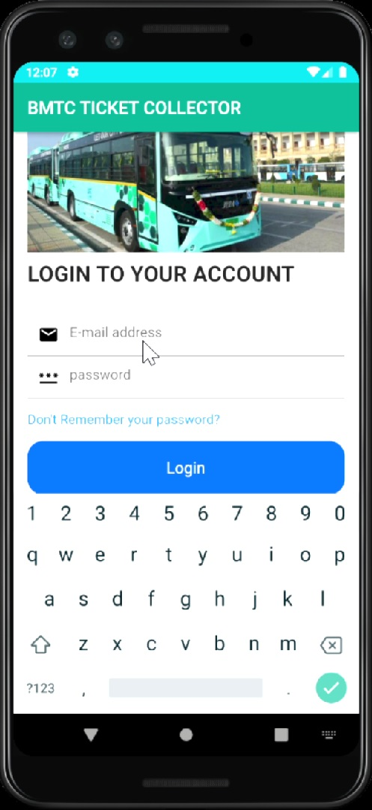
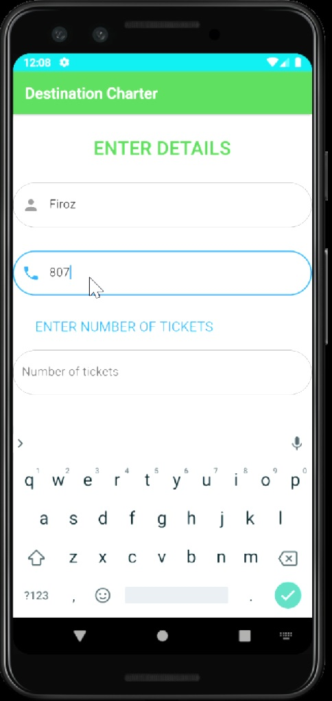
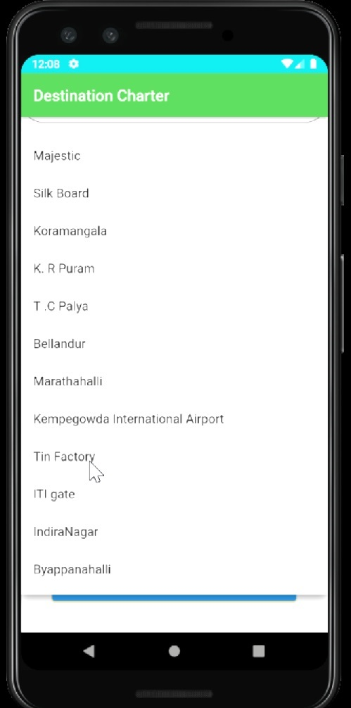
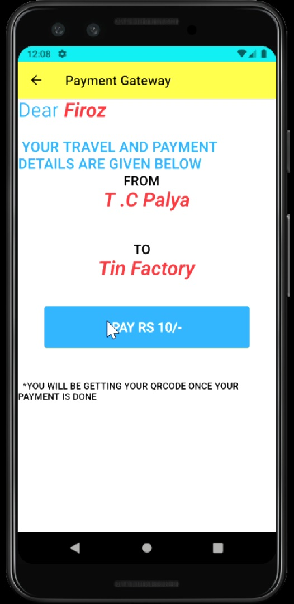
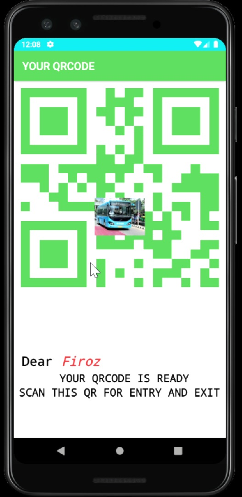

# loginmyapp
You can clone this repo
git clone " https://github.com/firoz3130/Smart-Bus-Travel/" your repo""
This simple Flutter App provides ticketless, continuous, short as well as long journeys.
It just needs us get a UNIQUE QR code for the journey.
<table>
<tr>
<td >Login</td>
<td >Details</td>

</tr>
  <tr>
  <td >Select Source& Destination</td>
   
<td >Payment</td>
<td >Ticket Generated</td>
  </tr>
</table>
